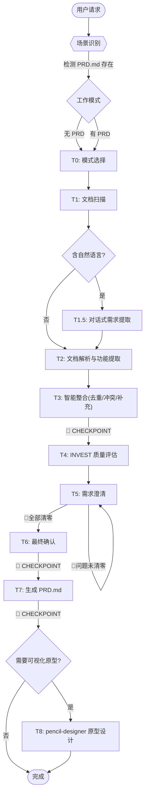

# 需求分析技能

<workflow>

## 工作流



> 分工标注: `[LLM 决策]` 语义/交互 | `[Script]` 确定性脚本 | `[LLM→Script]` 决策后脚本执行

### 场景识别

| 条件                 | 场景                 | 入口 Task |
| ------------------ | ------------------ | ------- |
| 工作区无 PRD.md，默认     | 标准模式 (standard)    | T0      |
| 工作区无 PRD.md，用户选择快速 | 快速模式 (quick)       | T0      |
| 工作区已有 PRD.md       | 增量模式 (incremental) | T0      |

### 跳过规则

- 无自然语言 → 跳过 T1.5；快速模式 → T5 批量确认；非增量 → 跳过 T6 变更展示；🔴 清零 → T5 提前结束；不生成原型 → 跳过 T8

</workflow>

<constraint name="全局约束">
- **冲突不自动解决**: 在 PRD 中列出所有版本并标注 `⚠️ 待确认`，必须由用户决定
- **🔴 严重矛盾清零前不得生成 PRD**
- **快速模式默认值标注**: 自动填充的默认值在 PRD 中标记 `默认值待确认`
- **问题分批**: 同一用户旅程内可一次性展示全部问题（允许超过 5 个）；跨旅程时每批最多 5 个。每个问题附带 A/B/C 选项，降低用户回答成本
- **每轮只改 1 个功能维度**: 修改后需重新确认
- **需求/功能/方案 分层甄别**: 对每条输入（含文档内容）先区分"需求 / 功能 / 方案"，用户提供的往往是"方案"而非真实"需求"，需上钻到需求后再提取，防止方案绑架需求
- **所有脚本通过 stdin JSON 接收、stdout JSON 输出**
- **脚本禁止使用关键词/正则匹配解析用户自然语言输入**
- **pencil-designer 原型设计为可选流程**: 用户明确选择后才执行，不阻塞主 PRD 生成流程
</constraint>

---

## 执行流程

<task name="模式选择与环境检测">

### Task 0: 模式选择与环境检测

**分工**: [LLM 决策]

- [ ] Step 1: 检查工作区根目录是否存在 `PRD.md`
  - 存在 → 读取已有 PRD.md，提取功能项列表，记 mode = incremental
  - 不存在 → 进入 Step 2
- [ ] Step 2: 询问用户是否需要**快速模式**（简化澄清、自动填默认值）
  - 未明确选择时默认 mode = standard
- [ ] 🔴 **CHECKPOINT**: 展示选定的工作模式，用户确认后再继续

**输出**: mode 标识（standard / quick / incremental）+ 增量模式下的已有功能项列表

</task>

<task name="文档扫描">

### Task 1: 文档扫描

**分工**: [LLM 决策]

- [ ] Step 1: 检查用户是否直接提供了自然语言描述
- [ ] Step 2: 扫描工作区根目录及子目录，匹配支持的扩展名
  - Markdown `.md/.markdown`｜Word `.docx`（`.doc` 需提示转换）｜Excel `.xlsx/.xls`｜思维导图 `.xmind/.mm/.mmap`
- [ ] Step 3: 排除系统目录（`node_modules`, `.git`, `dist`, `build`, `.venv` 等）
- [ ] Step 4: 按优先级分组并排序：自然语言 > Markdown > Word > Excel > 思维导图
- [ ] Step 5: 显示扫描结果摘要给用户

<example>
```
发现 5 个需求来源: 自然语言 1 | Markdown 2 | Word 1 | Excel 1
```
</example>

**输出**: 文档扫描清单 `{files: [{path, format, priority}]}`

</task>

<task name="对话式需求提取">

### Task 1.5: 对话式需求提取

**分工**: [LLM 决策]
**触发条件**: 仅当 T1 检测到自然语言输入时执行

> 对用户通过自然语言描述的需求进行策略性提取和澄清。

#### 1.5.0 需求/功能/方案 分层甄别（先分层，再提取）

用户常把"不成熟的方案"当成需求提出（例：要一台更快的马车，但汽车才是真正需要的）。提取前先做三层甄别，防止方案绑架需求：

| 层级 | 回答的问题 | 本质 | 示例 |
|------|-----------|------|------|
| 需求 (Need) | 为什么做 | 问题/目标/结果，动机，不可协商 | "更快、更省力地从 A 到 B" |
| 功能 (Feature) | 做什么 | 系统能力，可设计、可取舍 | "路线规划""自动导航""支付" |
| 方案 (Solution) | 怎么做 | 实现/技术/形态选型，可替换 | "马车""燃油车""电动车" |

**单向推导**: 需求 → 功能 → 方案；不能从方案倒推需求。

**上钻追问规则**（按输入形态选择）

| 输入形态 | 上钻方向 | 话术模板 | 示例 |
|---------|---------|---------|------|
| 只给**方案** | 下钻到需求 | "这是实现方式，你真正想要达成的**结果**是什么？" | "要更快的马车" → "是想更快省力地到达吗？" |
| 只给**功能** | 上钻到需求 | "这功能解决什么问题？不做它用户会遇到什么？" | "加评价" → "是让用户反馈，还是采集口碑？" |
| 已给**需求** | 往下推功能/方案 | "为达成目标，需要哪些能力？" | "更快到达" → 功能=交通调度；方案=汽车/公交 |

**甄别流程**: 先判断输入属于哪一层 → 方案则下钻到需求并记录候选（不锁死）；功能则上钻到需求确认"为什么做"；需求则确认后往下推功能/方案 → 保留「需求→功能→方案」映射写入 PRD 附录。

```
输入: "我要一台更快的马车"
→ 分层: 马车=方案；"更快"=隐含需求
→ 上钻: "马车是方案，你真正要的是『更快省力到达』这个结果吗？"
→ 沉淀: 需求=更快省力出行；功能=载人运输/快速移动；候选=马车改进/汽车/公交
→ 若只接受"马车"→ 锁死方案，错失汽车等更优解；需求必须先于方案落定
```

> 效果：把"用户要 X 系统"上钻为"解决 Y 问题"，避免做出一堆功能却偏离真实目标。

#### 1.5.1 输入类型识别

| 输入类型 | 特征          | 策略                          |
| ---- | ----------- | --------------------------- |
| 完整需求 | 有背景、目标、功能描述 | 直接提取，补充细节                   |
| 功能清单 | 只有功能名称列表    | **反推需求**: 从功能推导业务场景和用户角色    |
| 模糊想法 | "我想做一个XX系统" | **引导式提问**: 渐进式追问（宏观→核心→管理端） |
| 片段描述 | 零散的功能点      | **聚类归纳**: 识别模块归属，补全逻辑       |

#### 1.5.2 反推需求技巧（功能清单 → 需求）

用户只给功能列表时，按「角色 → 流程 → 隐含 → 边界」反推：

```
输入: "用户注册、用户登录、查看订单、申请退款"
→ 角色: 普通用户（前台），可能有管理员 → 追问"是否有管理员角色？能做什么？"
→ 流程: 注册→登录→购物→查看→售后 → 追问"如何下单？是否需要购物车？"
→ 隐含: 有登录无退出 → 补退出；有退款无审批 → 追问"谁审批？自动/人工？"
       有查看订单无状态 → 追问"订单有哪些状态？如何流转？"
→ 边界: "导出数据"→格式/范围/上限；"搜索"→条件/模糊；"消息通知"→渠道/触发
```

#### 1.5.3 引导式提问

按「宏观 → 核心 → 管理端」渐进追问：宏观（目标用户/商品类型/是否支付）→ 核心（浏览→下单→支付→发货）→ 管理端（商品/订单/用户/统计）。

#### 1.5.4 追问维度（交互原则）

每批问题附带 A/B/C 选项并标注优先级（🔴 必须 / 🟡 建议 / 🟢 可选），确认后复述理解、保留用户原始表述。

| 维度       | 追问方向      | 示例问题                          |
| -------- | --------- | ----------------------------- |
| **触发条件** | 什么情况下触发   | "用户注册在什么场景下触发？仅网页？App？第三方登录？" |
| **操作主体** | 谁来操作      | "这个功能只有用户自己能用，还是管理员也能操作？"     |
| **输入输出** | 需要什么/产出什么 | "导入数据支持什么格式？导出后文件在哪里获取？"      |
| **业务规则** | 约束和逻辑     | "删除功能是物理删除还是软删除？删除后能恢复吗？"     |
| **异常处理** | 出错怎么办     | "支付失败怎么处理？订单超时未支付会自动取消吗？"     |
| **关联功能** | 与其他功能的关系  | "这个操作会触发通知吗？需要记录操作日志吗？"       |

#### 1.5.5 🔴 提取完成检查点

展示提取结果供用户确认：

```
📋 需求提取结果
  用户角色: [角色1], [角色2]
  核心业务流程: [流程描述]
  识别到的功能: 模块 [模块名]: 1.[功能1] 2.[功能2]
  待补充信息: [缺失项1]

A. ✅ 确认，继续解析文档  B. 📝 需要修改（请指出）  C. ⏸ 暂停
```

**输出**: 用户确认后的结构化需求描述（统一中间格式）

**执行规则**: A→进入阶段 2；B→修改后重新确认；C→暂停，保存进度

</task>

<task name="文档解析与功能提取">

### Task 2: 文档解析与功能提取

**分工**: [Script 执行]

- [ ] Step 1: 对每个文档，调用 `scripts/parse_document.py`：

```bash
echo '{"path": "<file_path>", "format": "<markdown|docx|xlsx|xmind|mm>"}' | python scripts/parse_document.py
```

- [ ] Step 2: **分层提取判断** — 调用 `scripts/chunked_extractor.py` 的 `analyze` 模式，输出骨架层：

```bash
echo '{"mode":"analyze","parsed_data": <parse_document 输出>}' | python scripts/chunked_extractor.py
```

返回 `{too_large, total_features, chunk_count, chunk_size, modules:[...]}`。
- `too_large=false` → 走单次提取（feature_extractor）
- `too_large=true` → **分层提取**，避免一次读入全部超出上下文窗口：骨架确认（展示模块/功能名/数量）→ 按 `chunk_index` 逐批 `chunk` 提取（每批 ≤ `chunk_size` 项）→ 全部完成后 `merge` 合并去重

```bash
# 小文件：单次提取
echo '{"parsed_data": <parse_document 输出>}' | python scripts/feature_extractor.py
# 大文件：分层提取（骨架 → 逐批 → 合并）
echo '{"mode":"chunk","parsed_data": ...,"chunk_index":0}' | python scripts/chunked_extractor.py
echo '{"mode":"merge","chunks":[<各批 features>]}' | python scripts/chunked_extractor.py
```

> 📎 参考: `references/输入格式示例.md` — 各格式的典型结构和统一中间格式说明

**错误处理**:

| 异常             | 处理                                           |
| -------------- | -------------------------------------------- |
| 格式不支持          | 跳过文件，显示 `⚠️ 文件 xxx 格式不支持`                    |
| 文件损坏           | 跳过，显示 `❌ 无法解析 xxx: 文件损坏`                     |
| Word/Excel 缺依赖 | 提示 `pip install python-docx openpyxl`，询问是否继续 |
| 大文件 >5MB       | 提示用户，询问是否跳过                                  |
| 无功能项识别到        | 提示用户检查文档格式或补充描述                              |

**输出**: 统一中间格式 JSON 数组 `[{id, name, description, module, priority, fields, actions, source}]`

- [ ] Step 3: [LLM 决策] **信息补充** — 必需字段缺失时从高优先级文档补充，仍缺失标记"待补充"

> 📎 参考: `references/冲突标注示例.md` — 冲突标注的标准格式

- [ ] 🔴 **CHECKPOINT**: 展示整合摘要供用户确认

```
📊 整合摘要

- 识别模块: X 个 | 功能项: Y 个
- 去重合并: Z 项 | 冲突检测: M 处

A. ✅ 继续
B. 📝 查看详细功能列表
C. ⏸ 暂停
```

**输出**: 整合后的功能列表 + 冲突报告

**执行规则**:

- 用户选择 A → 进入阶段 5
- 用户选择 B → 展示所有功能项详情，再询问
- 用户选择 C → 暂停，保存进度

</task>

<task name="INVEST需求质量评估">

### Task 4: INVEST 需求质量评估

**分工**: [Script 执行]

- [ ] Step 1: 调用 `scripts/invest_assessor.py` 对每个功能项执行六维评估：

```bash
echo '{"features": [<整合后的功能列表>]}' | python scripts/invest_assessor.py
```

**INVEST 评估维度**: Independent（能否独立实现/测试）、Negotiable（实现细节可协商）、Valuable（体现业务/用户价值）、Estimable（描述具体可估算）、Small（功能粒度单一职责）、Testable（验收标准明确），每项评 ★ 1-3。

**输出**: INVEST 评分报告（每项 1-3★ + 建议），作为 PRD 附录

</task>

<task name="需求澄清">

### Task 5: 需求澄清

**分工**: [LLM 决策]

#### 5.0 NFR 基线规则（默认值，无需逐条提问）

进入澄清前，先按下列基线为 PRD 附录填入默认值，仅当触发特殊条件时才升级为 🔴 问题：

| NFR 项 | 默认基线 | 触发特殊提问的条件 |
|--------|----------|--------------------|
| 并发量 | 按"日均 1000 UV"设计 | 用户明确大促/高并发场景 |
| 数据保留 | 永久保留 / 按合规保留 3 年 | 涉及金融、审计、隐私合规特殊要求 |
| 删除操作 | 软删除 + 操作日志 | 涉及不可恢复/强审计需求 |
| 安全加密 | 常规传输加密 | 涉及金融级加密、支付密钥等 |
| 可用性 | 常规（99.9%） | 用户明确 SLA 要求 |

> 效果：自动填平约 80% 的非功能坑，仅将极端特殊情况（如"金融级加密"）作为 🔴 问题抛出。

- [ ] Step 0: 生成 NFR 基线清单，写入 PRD 附录；无特殊情况不单独提问

#### 5.1 问题检测与分级

| 问题类型     | 严重   | 示例                     |
| -------- |:----:| ---------------------- |
| 🔴 逻辑矛盾  | 必须解决 | "仅管理员可操作" vs "所有用户可操作" |
| 🔴 模糊描述  | 必须解决 | "管理用户信息"（无具体操作）        |
| 🟡 边界不明  | 建议澄清 | "导出数据"但未说明格式/范围        |
| 🟡 歧义表述  | 建议澄清 | "定时发送通知"（什么条件触发？）      |
| 🟢 缺失上下文 | 可选完善 | "审批流程"但未定义审批角色         |

#### 5.2 标准模式（MoSCoW 锚定 + 旅程分批 + 冲突可视化）

- [ ] Step 1: **MoSCoW 优先级锚定** — 先为每个功能项推断 Must-Have / Should-Have / Could-Have / Won't-Have
  - 遇到棘手模糊问题时先问："该功能在 MVP 阶段是否为 **Must-Have**？若非，可暂用人工手动配置简化逻辑，不再深究细节。"
  - 将非 Must-Have 的模糊功能标记为"可简化"，不再逐条澄清细节，聚焦核心主干
- [ ] Step 2: 收集所有功能项中的问题，按**用户核心旅程**分组（注册登录流程 / 浏览下单流程 / 售后维权流程 / 管理后台流程 等），而非按严重程度排序
- [ ] Step 3: **一次性问完当前旅程的所有问题**（同一场景可超过 5 个），让用户整体思考一条完整故事线；附原文引用 + 类型标签 + 建议方向
- [ ] Step 4: **冲突可视化** — 检测到矛盾时生成"冲突影响分析表"（来源 A / 来源 B / 业务影响 / 建议方案），而非纯文字标注，如：订单删除 → 物理删除 vs 软删除，影响客服误删恢复，建议软删除。

- [ ] Step 5: 用户回复后更新功能项，检查是否产生新问题
- [ ] Step 6: 重复直到所有 🔴 问题清零
- [ ] Step 7: 输出澄清报告

#### 5.3 快速模式

- [ ] Step 1: 检测问题并收集列表，但**不逐条交互**
- [ ] Step 2: 对模糊/缺失项自动填入**合理默认值**
- [ ] Step 3: 一条消息展示所有默认值，让用户批量确认（全部接受/修改部分/切换标准模式）
- [ ] Step 4: 用户拒绝的项标记"待确认"在 PRD 中

**输出**: 澄清后的功能列表（🔴 问题清零）+ NFR 基线清单

</task>

<task name="最终确认">

### Task 6: 最终确认

**分工**: [LLM 决策]

- [ ] Step 1: **前置检查** — 确认所有 🔴 矛盾已解决。未解决时提示用户返回 T5
- [ ] Step 2 (增量模式): 展示变更差异让用户确认：

```
📊 变更检测
  - 新增: 3 个 | 变更: 1 个 | 移除: 0 个 | 未变更: 8 个
1. ✅ 确认合并  2. 🔄 查看详细变更  3. ⏸ 暂停
```

- [ ] Step 3 (标准/快速模式): 展示缺失项标注

```
⚠️ 功能"用户注册"缺少字段类型信息，将在 PRD 中标注"待补充"
1. ✅ 确认生成  2. ⏸ 暂停补充信息
```

- [ ] 🔴 **CHECKPOINT**: 等待用户明确确认

**输出**: 用户确认标记 + 最终功能列表

</task>

> 📎 参考样例文件: `references/PRD模板.md`（PRD 标准模板）、`references/数据字典示例.md`（数据字典格式）、`references/冲突标注示例.md`（冲突/待确认标注格式）

<task name="生成PRD">

### Task 7: 生成 PRD.md

**分工**: [Script 执行]

- [ ] Step 1: **选择输出路径** — 调用 `scripts/suggest_output.py`，结合当前目录结构推荐输出位置：

```bash
echo '{"cwd": "<工作区根目录>", "default": "PRD.md"}' | python scripts/suggest_output.py
```

返回 `{recommended, reason, choices, doc_dirs, existing_prd}`。向用户展示推荐理由与选项：
- 默认推荐：检测到文档类子目录 → 输出到该子目录；否则输出到工作区根目录
- 用户可指定任意子目录（如 `docs/PRD.md`、`output/需求/PRD.md`），支持增量模式沿用已有 PRD 所在路径

- [ ] Step 2: **选择输出模板** — 询问用户需要哪种版本：
  - `full`（完整版）— 含字段说明/按钮逻辑/交互说明 + 附录 INVEST 质量评估（默认）
  - `summary`（业务摘要版）— 删减数据字典等技术细节，仅保留业务视角的功能清单与验收标准

- [ ] Step 3: 调用 `scripts/prd_generator.py`：

```bash
echo '{
  "features": [...],
  "assessments": [...],
  "conflicts": [...],
  "mode": "standard|quick|incremental",
  "template": "full|summary",
  "version": "1.0.0",
  "project_name": "<从需求推断或询问用户>",
  "pending_items": [...],
  "nfr_baseline": [{"name": "并发量", "default": "日均 1000 UV", "trigger": "大促/高并发场景"}],
  "need_feature_map": [{"need": "更快到达", "feature": "交通调度", "solution": "汽车/公共交通"}]
}' | python scripts/prd_generator.py --output "<Step 1 选定路径>"
```

> 📎 参考: `references/PRD模板.md` — PRD 标准模板结构（含完整版/摘要版差异）
> 📎 参考: `references/数据字典示例.md` — 数据字典格式

- [ ] Step 4: **增量模式特殊处理**:
  - 保留已有 PRD 中未变更内容
  - 新增功能追加到对应模块
  - 变更功能在原位更新并标注 `> 🔄 本次变更`
  - 版本号递增（v1.0.0 → v1.1.0）

**PRD 必需章节**: 需求概述 → 功能清单 → 附录（变更历史 + 待确认事项；完整版含 INVEST 质量评估）

**输出**: 用户选定路径下的 `PRD.md`（完整版或业务摘要版）

</task>

<task name="可视化原型设计">

### Task 8: 可视化原型设计（可选）

**分工**: [LLM→Script] — LLM 决策是否启动，调用 pencil-designer skill 执行

> **触发条件**: 用户在 PRD 确认后提出可视化原型需求，或 PRD.md 中标记了需要原型设计的模块。
> **依赖**: 本 Task 依赖 Task 7 输出的 PRD.md。
> **环境检查说明**: pen.dev 环境探测、后端选择、CLI/MCP 命令等细节由 pencil-designer skill 自行处理，本 skill 只做简单引导，不重复执行。

#### 8.1 是否需要原型设计？

- [ ] Step 1: 展示 PRD.md 摘要，询问用户是否需要生成可视化原型

```
📊 PRD 已生成，检测到以下模块：[模块1]（N 项）、[模块2]（M 项）...
是否需要基于此 PRD 生成可视化原型？
1. ✅ 是，使用 pencil-designer 生成原型
2. 📝 我需要先修改 PRD 再生成
3. ⏸ 暂不生成，仅输出 PRD.md
```

- [ ] 🔴 **CHECKPOINT**: 用户选择"否"则跳过本 Task，流程结束

#### 8.2 简单引导调用 pencil-designer

用户选择"✅ 是"时，只做以下引导，其余交给 pencil-designer：

- [ ] Step 1: 将 **PRD.md 路径** 与 **用户原始需求** 透传给 pencil-designer skill，明确说明"基于此 PRD 生成可视化原型"
- [ ] Step 2: 不重复执行环境探测 / 后端选择 / CLI-MCP 命令，交由 pencil-designer 按自身流程处理

**输出**: 由 pencil-designer 生成的 `design.pen` 原型文件 + 可交互原型

#### 8.3 完成检查点

```
✅ 原型生成完成！原型文件: design.pen | 可交互原型: design-prototype.html
A. ✅ 确认完成，流程结束  B. 📝 需要修改设计（反馈传入 pencil-designer 迭代）  C. ⏸ 暂停，保存进度
```

**执行规则**:
- 用户选择 A → 流程结束
- 用户选择 B → 将修改意见传入 pencil-designer，迭代修改 design.pen
- 用户选择 C → 暂停，保存进度

</task>

## 错误处理

| 场景            | 处理方式                          |
| ------------- | ----------------------------- |
| 工作区无需求文档      | 提示支持格式，询问是否指定文件或直接描述需求        |
| 自然语言描述过短      | 追问: "能否补充更多细节？目标用户、核心功能、关键约束" |
| 对话中信息矛盾       | 标记矛盾项，列出两个版本让用户选择             |
| 反推需求无法确定领域    | 列出可能的领域选项让用户选择                |
| 中间格式关键字段缺失    | 暂停该功能处理，标记"待补充"，继续处理其他        |
| 增量模式 PRD 格式异常 | 警告格式不标准，询问是否覆盖为新版本            |
| 增量模式差异 >70%   | 建议作为全新版本处理，询问是否切换标准模式         |
| 用户中途修改已确认项    | 允许回退到对应阶段，重新执行确认流程            |
| 多文档同优先级       | 按名字母序排列，冲突时标注所有来源供选择          |

---

## 注意事项

1. 文档用 UTF-8；2. 冲突需用户最终确认，技能不自动解决；3. 🔴 严重矛盾解决前不得生成 PRD；4. 增量模式依赖 PRD.md 格式一致性
