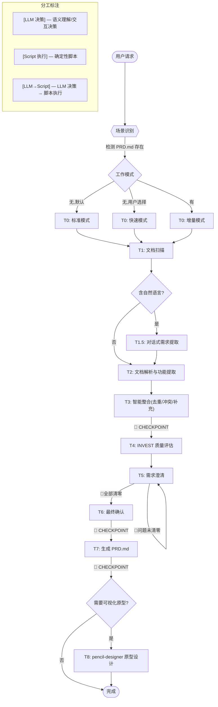

# 需求分析技能

<workflow>

## 工作流



### 场景识别

| 条件                 | 场景                 | 入口 Task |
| ------------------ | ------------------ | ------- |
| 工作区无 PRD.md，默认     | 标准模式 (standard)    | T0      |
| 工作区无 PRD.md，用户选择快速 | 快速模式 (quick)       | T0      |
| 工作区已有 PRD.md       | 增量模式 (incremental) | T0      |

### 跳过规则

- 无自然语言输入 → 跳过 T1.5
- 快速模式 → T5 简化为批量确认
- 非增量模式 → 跳过 T6 的变更差异展示
- 🔴 问题全部已清零 → T5 可提前结束
- 用户选择不生成原型 → 跳过 T8

</workflow>

<constraint name="全局约束">
- **冲突不自动解决**: 在 PRD 中列出所有版本并标注 `⚠️ 待确认`，必须由用户决定
- **🔴 严重矛盾清零前不得生成 PRD**
- **快速模式默认值标注**: 自动填充的默认值在 PRD 中标记 `默认值待确认`
- **一次最多问 5 个问题**: 每个问题附带 A/B/C 选项，降低用户回答成本
- **每轮只改 1 个功能维度**: 修改后需重新确认
- **所有脚本通过 stdin JSON 接收、stdout JSON 输出**
- **脚本禁止使用关键词/正则匹配解析用户自然语言输入**
- **pencil-designer 原型设计为可选流程**: 用户明确选择后才执行，不阻塞主 PRD 生成流程
</constraint>

---

## 执行流程

<task name="模式选择与环境检测">

### Task 0: 模式选择与环境检测

**分工**: [LLM 决策]

- [ ] Step 1: 检查工作区根目录是否存在 `PRD.md`
  - 存在 → 读取已有 PRD.md，提取功能项列表，记 mode = incremental
  - 不存在 → 进入 Step 2
- [ ] Step 2: 询问用户是否需要**快速模式**（简化澄清、自动填默认值）
  - 未明确选择时默认 mode = standard
- [ ] 🔴 **CHECKPOINT**: 展示选定的工作模式，用户确认后再继续

**输出**: mode 标识（standard / quick / incremental）+ 增量模式下的已有功能项列表

</task>

<task name="文档扫描">

### Task 1: 文档扫描

**分工**: [LLM 决策]

- [ ] Step 1: 检查用户是否直接提供了自然语言描述
- [ ] Step 2: 扫描工作区根目录及子目录，匹配支持的扩展名
  - Markdown: `.md`, `.markdown`
  - Word: `.docx`（`.doc` 需提示用户转换格式）
  - Excel: `.xlsx`, `.xls`
  - 思维导图: `.xmind`, `.mm`, `.mmap`
- [ ] Step 3: 排除系统目录（`node_modules`, `.git`, `dist`, `build`, `.venv` 等）
- [ ] Step 4: 按优先级分组并排序：自然语言 > Markdown > Word > Excel > 思维导图
- [ ] Step 5: 显示扫描结果摘要给用户

<example>
```
发现 5 个需求来源:
  - 自然语言描述: 1 个
  - Markdown: 2 个
  - Word: 1 个
  - Excel: 1 个
```
</example>

**输出**: 文档扫描清单 `{files: [{path, format, priority}]}`

</task>

<task name="对话式需求提取">

### Task 1.5: 对话式需求提取

**分工**: [LLM 决策]
**触发条件**: 仅当 T1 检测到自然语言输入时执行

> 对用户通过自然语言描述的需求进行策略性提取和澄清。

#### 1.5.1 输入类型识别

| 输入类型 | 特征          | 策略                          |
| ---- | ----------- | --------------------------- |
| 完整需求 | 有背景、目标、功能描述 | 直接提取，补充细节                   |
| 功能清单 | 只有功能名称列表    | **反推需求**: 从功能推导业务场景和用户角色    |
| 模糊想法 | "我想做一个XX系统" | **引导式提问**: 渐进式追问（宏观→核心→管理端） |
| 片段描述 | 零散的功能点      | **聚类归纳**: 识别模块归属，补全逻辑       |

#### 1.5.2 反推需求技巧

当用户只提供功能列表时，按以下顺序反推：

**Step 1: 识别用户角色**

```
输入: "用户注册、用户登录、查看订单、申请退款"
→ 推断角色: 普通用户（前台）、可能有管理员（未提及）
→ 追问: "系统是否有管理员角色？管理员能做什么？"
```

**Step 2: 推导业务流程**

```
功能: 用户注册 → 用户登录 → 查看订单 → 申请退款
→ 推导流程: 注册→登录→购物→查看→售后
→ 追问: "用户如何下单？是否需要购物车？"
```

**Step 3: 补全隐含功能**

```
有"用户登录"但无"用户退出" → 补全退出功能
有"申请退款"但无"退款审批" → 追问: "退款由谁审批？自动还是人工？"
有"查看订单"但无"订单状态" → 追问: "订单有哪些状态？状态如何流转？"
```

**Step 4: 追问边界条件**

```
"导出数据" → 追问: "导出格式是什么？Excel/CSV/PDF？数据量上限？"
"搜索功能" → 追问: "支持哪些搜索条件？是否有模糊搜索？"
"消息通知" → 追问: "通知渠道？邮件/短信/站内信？触发条件？"
```

#### 1.5.3 引导式提问

```
第一轮(宏观):   目标用户/商品类型/是否需要支付
第二轮(核心):   核心流程确认（浏览→下单→支付→发货）
第三轮(管理端): 后台功能（商品/订单/用户/统计）
```

#### 1.5.4 交互原则

- 一次最多问 5 个问题，附带建议选项（A/B/C）
- 标注优先级: 🔴 必须回答 / 🟡 建议回答 / 🟢 可选
- 确认后复述理解，让用户验证
- 保留用户原始表述，不要过度解读

| 维度       | 追问方向      | 示例问题                          |
| -------- | --------- | ----------------------------- |
| **触发条件** | 什么情况下触发   | "用户注册在什么场景下触发？仅网页？App？第三方登录？" |
| **操作主体** | 谁来操作      | "这个功能只有用户自己能用，还是管理员也能操作？"     |
| **输入输出** | 需要什么/产出什么 | "导入数据支持什么格式？导出后文件在哪里获取？"      |
| **业务规则** | 约束和逻辑     | "删除功能是物理删除还是软删除？删除后能恢复吗？"     |
| **异常处理** | 出错怎么办     | "支付失败怎么处理？订单超时未支付会自动取消吗？"     |
| **关联功能** | 与其他功能的关系  | "这个操作会触发通知吗？需要记录操作日志吗？"       |

#### 1.5.5 🔴 提取完成检查点

展示提取结果供用户确认：

```
📋 需求提取结果
  用户角色: [角色1], [角色2]
  核心业务流程: [流程描述]
  识别到的功能:
    模块 [模块名]:
      1. [功能1] - [简述]
      2. [功能2] - [简述]
  待补充信息:
    - [缺失项1]

A. ✅ 确认，继续解析文档
B. 📝 需要修改（请指出）
C. ⏸ 暂停
```

**输出**: 用户确认后的结构化需求描述（统一中间格式）

**执行规则**:

- 用户选择 A → 进入阶段 2
- 用户选择 B → 修改后重新确认
- 用户选择 C → 暂停，保存进度

</task>

<task name="文档解析与功能提取">

### Task 2: 文档解析与功能提取

**分工**: [Script 执行]

- [ ] Step 1: 对每个文档，调用 `scripts/parse_document.py`：

```bash
echo '{"path": "<file_path>", "format": "<markdown|docx|xlsx|xmind|mm>"}' | python scripts/parse_document.py
```

- [ ] Step 2: 调用 `scripts/feature_extractor.py` 将解析结果转为结构化功能列表：

```bash
echo '{"parsed_data": <parse_document 输出>}' | python scripts/feature_extractor.py
```

> 📎 参考: `references/input-format-example.md` — 各格式的典型结构和统一中间格式说明

**错误处理**:

| 异常             | 处理                                           |
| -------------- | -------------------------------------------- |
| 格式不支持          | 跳过文件，显示 `⚠️ 文件 xxx 格式不支持`                    |
| 文件损坏           | 跳过，显示 `❌ 无法解析 xxx: 文件损坏`                     |
| Word/Excel 缺依赖 | 提示 `pip install python-docx openpyxl`，询问是否继续 |
| 大文件 >5MB       | 提示用户，询问是否跳过                                  |
| 无功能项识别到        | 提示用户检查文档格式或补充描述                              |

**输出**: 统一中间格式 JSON 数组 `[{id, name, description, module, priority, fields, actions, source}]`

```
- [ ] Step 3: [LLM 决策] **信息补充** — 必需字段缺失时从高优先级文档补充，仍缺失标记"待补充"

> 📎 参考: `references/conflict-annotation-example.md` — 冲突标注的标准格式

- [ ] 🔴 **CHECKPOINT**: 展示整合摘要供用户确认
```

📊 整合摘要

- 识别模块: X 个 | 功能项: Y 个
- 去重合并: Z 项 | 冲突检测: M 处

A. ✅ 继续
B. 📝 查看详细功能列表
C. ⏸ 暂停

```
**输出**: 整合后的功能列表 + 冲突报告

**执行规则**:

- 用户选择 A → 进入阶段 5
- 用户选择 B → 展示所有功能项详情，再询问
- 用户选择 C → 暂停，保存进度

</task>

<task name="INVEST需求质量评估">

### Task 4: INVEST 需求质量评估

**分工**: [Script 执行]

- [ ] Step 1: 调用 `scripts/invest_assessor.py` 对每个功能项执行六维评估：

```bash
echo '{"features": [<整合后的功能列表>]}' | python scripts/invest_assessor.py
```

**INVEST 评估维度**:

| 维度              | 含义            | 评分标准              |
| --------------- | ------------- | ----------------- |
| **I**ndependent | 功能能否独立实现和测试   | ★ 强依赖 → ★★★ 高度独立  |
| **N**egotiable  | 实现细节是否有讨论空间   | ★ 刚性描述 → ★★★ 有弹性  |
| **V**aluable    | 是否明确体现业务/用户价值 | ★ 只有操作 → ★★★ 价值清晰 |
| **E**stimable   | 描述是否足够具体以便估算  | ★ 模糊 → ★★★ 细节充分   |
| **S**mall       | 功能粒度是否合理      | ★ 大模块级 → ★★★ 单一职责 |
| **T**estable    | 是否有明确的验收标准    | ★ 无法验证 → ★★★ 验收明确 |

**输出**: INVEST 评分报告（每项 1-3★ + 建议），作为 PRD 附录

</task>

<task name="需求澄清">

### Task 5: 需求澄清

**分工**: [LLM 决策]

#### 5.1 问题检测与分级

| 问题类型     | 严重   | 示例                     |
| -------- |:----:| ---------------------- |
| 🔴 逻辑矛盾  | 必须解决 | "仅管理员可操作" vs "所有用户可操作" |
| 🔴 模糊描述  | 必须解决 | "管理用户信息"（无具体操作）        |
| 🟡 边界不明  | 建议澄清 | "导出数据"但未说明格式/范围        |
| 🟡 歧义表述  | 建议澄清 | "定时发送通知"（什么条件触发？）      |
| 🟢 缺失上下文 | 可选完善 | "审批流程"但未定义审批角色         |

#### 5.2 标准模式

- [ ] Step 1: 收集所有功能项中的问题，按严重程度排序，按模块分组
- [ ] Step 2: 每批最多展示 5 个问题，附原文引用 + 类型标签 + 建议方向
- [ ] Step 3: 用户回复后更新功能项，检查是否产生新问题
- [ ] Step 4: 重复直到所有 🔴 问题清零
- [ ] Step 5: 输出澄清报告

#### 5.3 快速模式

- [ ] Step 1: 检测问题并收集列表，但**不逐条交互**
- [ ] Step 2: 对模糊/缺失项自动填入**合理默认值**
- [ ] Step 3: 一条消息展示所有默认值，让用户批量确认（全部接受/修改部分/切换标准模式）
- [ ] Step 4: 用户拒绝的项标记"待确认"在 PRD 中

**输出**: 澄清后的功能列表（🔴 问题清零）

</task>

<task name="最终确认">

### Task 6: 最终确认

**分工**: [LLM 决策]

- [ ] Step 1: **前置检查** — 确认所有 🔴 矛盾已解决。未解决时提示用户返回 T5
- [ ] Step 2 (增量模式): 展示变更差异让用户确认：

```
📊 变更检测
  - 新增功能: 3 个
  - 变更功能: 1 个
  - 移除功能: 0 个
  - 未变更: 8 个

1. ✅ 确认合并
2. 🔄 查看详细变更
3. ⏸ 暂停
```

- [ ] Step 3 (标准/快速模式): 展示缺失项标注

```
⚠️ 功能"用户注册"缺少字段类型信息，将在 PRD 中标注"待补充"
是否继续生成 PRD？
1. ✅ 确认生成
2. ⏸ 暂停补充信息
```

- [ ] 🔴 **CHECKPOINT**: 等待用户明确确认

**输出**: 用户确认标记 + 最终功能列表

</task>

> 📎 参考样例文件:
> 
> - `references/PRD-template.md` — PRD 标准模板（章节结构和格式规范）
> - `references/data-dictionary-example.md` — 数据字典格式和类型映射
> - `references/conflict-annotation-example.md` — 冲突和待确认项的标注格式

<task name="生成PRD">

### Task 7: 生成 PRD.md

**分工**: [Script 执行]

- [ ] Step 1: 调用 `scripts/prd_generator.py`：

```bash
echo '{
  "features": [...],
  "assessments": [...],
  "conflicts": [...],
  "mode": "standard|quick|incremental",
  "version": "1.0.0",
  "project_name": "<从需求推断或询问用户>",
  "pending_items": [...]
}' | python scripts/prd_generator.py --output ./PRD.md
```

> 📎 参考: `references/PRD-template.md` — PRD 标准模板结构
> 📎 参考: `references/data-dictionary-example.md` — 数据字典格式

- [ ] Step 2: **增量模式特殊处理**:
  - 保留已有 PRD 中未变更内容
  - 新增功能追加到对应模块
  - 变更功能在原位更新并标注 `> 🔄 本次变更`
  - 版本号递增（v1.0.0 → v1.1.0）

**PRD 必需章节**: 需求概述 → 功能清单 → 页面结构 → 数据字段 → 附录（变更历史 + 待确认事项 + INVEST 质量评估）

**输出**: 工作区根目录 `PRD.md`

</task>

<task name="可视化原型设计">

### Task 8: 可视化原型设计（可选）

**分工**: [LLM→Script] — LLM 决策是否启动，调用 pencil-designer skill 执行

> **触发条件**: 用户在 PRD 确认后提出可视化原型需求，或 PRD.md 中标记了需要原型设计的模块。
> **依赖**: 本 Task 依赖 Task 7 输出的 PRD.md。pencil-designer skill 的 Step 1-2 会自动读取 PRD.md。

#### 8.1 是否需要原型设计？

- [ ] Step 1: 展示 PRD.md 摘要，询问用户是否需要生成可视化原型

```
📊 PRD 已生成，检测到以下模块：
  - [模块1]: [功能数] 个功能项
  - [模块2]: [功能数] 个功能项
  - ...

是否需要基于此 PRD 生成可视化原型？
1. ✅ 是，使用 pencil-designer 生成原型
2. 📝 我需要先修改 PRD 再生成
3. ⏸ 暂不生成，仅输出 PRD.md
```

- [ ] 🔴 **CHECKPOINT**: 用户选择"否"则跳过本 Task，流程结束

#### 8.2 调用 pencil-designer

用户选择"✅ 是"时，按 pencil-designer skill 流程执行：

- [ ] Step 1: **环境探测** — 运行 pencil-designer 的 §1 环境探测

```bash
# pen.dev 环境检测
which pen >/dev/null 2>&1 && pen version 2>/dev/null | tail -1 || echo "pen: 未安装"
pgrep -f "Pen.app" >/dev/null 2>&1 && echo "Pen.app: 运行中" || echo "Pen.app: 未运行"
```

- [ ] Step 2: **选择后端** — 用 AskUserQuestion 让用户选择设计工具后端
  - `pen.dev（已就绪，推荐）` — 本地生成，必然可用
  - `墨刀（未配置，选此项需先授权）` — 需墨刀 MCP 已连接

- [ ] Step 3: **PRD 读取** — pencil-designer 自动读取当前及上级目录的 PRD.md
  - 提取项目概述、功能模块、数据字段、业务流程
  - 若 PRD.md 缺失或格式异常，回退到人工描述

- [ ] Step 4: **设计规范** — 检查是否有 `UI Design.pen`，无则创建
  - 沉淀色彩、字体、组件风格

- [ ] Step 5: **CLI 出图** — 调用 pen.dev CLI Agent 模式生成原型

```bash
pen --out design.pen --prompt "基于 PRD.md 生成页面原型，包含以下模块: [模块列表]" --export design.png --export-scale 2
```

> ⚠️ 透传用户原话，不要自行扩写 prompt。生成时间: 简单 1-2 分钟、复杂 3-5+ 分钟。超时至少设 600000ms。

- [ ] Step 6: **MCP 精细控制**（可选）— 若 CLI 结果不理想，使用 MCP Interactive 模式微调

```bash
pen interactive -i design.pen -o design-v2.pen
```

- [ ] Step 7: **Context 补录** — 为交互控件补录 context 信息

```js
Get(pageId, n => /^btn-|^input-|^select-/.test(n.name) && !n.context && Update(n.id, {context:"..."}))
```

- [ ] Step 8: **导出可交互原型** — 生成三栏可交互 HTML 原型

```bash
# 使用 execute 的 Export 导出
# 或通过 MCP Interactive 模式生成 {原文件名}-prototype.html
```

**输出**: `design.pen` 原型文件 + `{原文件名}-prototype.html` 可交互原型

#### 8.3 异常处理

| 场景 | 处理方式 |
| --- | --- |
| pen.dev 未安装 | 引导 `npm install -g @pen.dev/cli`，Node >= 18 |
| PRD.md 缺失或格式异常 | 回退到人工描述模式，让用户补充需求说明 |
| 用户拒绝授权 | 跳过原型生成，流程结束 |
| 生成超时（>10分钟）| 提示用户，可降低复杂度重试或保存中间状态 |
| 后端不可用 | 回退到 pen.dev 本地后端（必然可用） |

#### 8.4 完成检查点

```
✅ 原型生成完成！
  原型文件: design.pen
  可交互原型: design-prototype.html

A. ✅ 确认完成，流程结束
B. 📝 需要修改设计（将反馈传入 pencil-designer 迭代）
C. ⏸ 暂停，保存进度
```

**执行规则**:
- 用户选择 A → 流程结束
- 用户选择 B → 将修改意见传入 pencil-designer，迭代修改 design.pen
- 用户选择 C → 暂停，保存进度

</task>

## 错误处理

| 场景            | 处理方式                          |
| ------------- | ----------------------------- |
| 工作区无需求文档      | 提示支持格式，询问是否指定文件或直接描述需求        |
| 自然语言描述过短      | 追问: "能否补充更多细节？目标用户、核心功能、关键约束" |
| 对话中信息矛盾       | 标记矛盾项，列出两个版本让用户选择             |
| 反推需求无法确定领域    | 列出可能的领域选项让用户选择                |
| 中间格式关键字段缺失    | 暂停该功能处理，标记"待补充"，继续处理其他        |
| 增量模式 PRD 格式异常 | 警告格式不标准，询问是否覆盖为新版本            |
| 增量模式差异 >70%   | 建议作为全新版本处理，询问是否切换标准模式         |
| 用户中途修改已确认项    | 允许回退到对应阶段，重新执行确认流程            |
| 多文档同优先级       | 按名字母序排列，冲突时标注所有来源供选择          |

---

## 注意事项

1. 确保文档使用 UTF-8 编码（非 UTF-8 可能解析异常）
2. 所有冲突需要用户最终确认，技能不自动解决
3. 🔴 严重矛盾解决前不得生成 PRD
4. 增量模式依赖现有 PRD.md 的格式一致性，手动修改可能导致解析偏差
