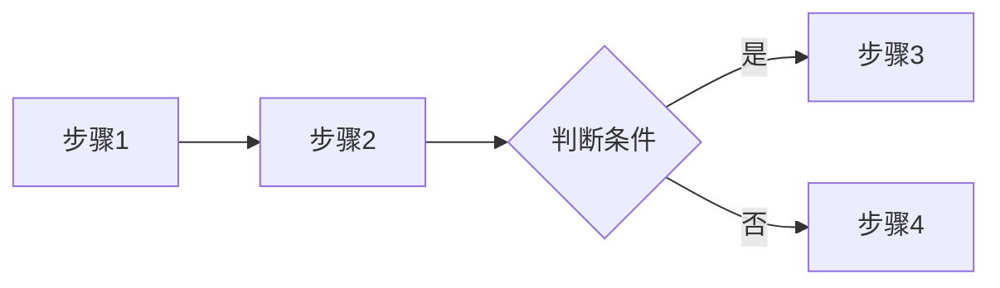
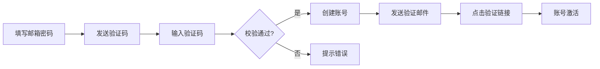

# PRD 模板

> 本模板定义了 requirement-analysis skill 生成 PRD.md 的标准格式。
> 生成 PRD 时应严格遵循此模板的章节结构和格式规范。

---

## 两种输出模板

本技能支持两种模板，由 `prd_generator.py` 的 `template` 参数控制：

| 模板 | 说明 | 保留章节 |
|------|------|----------|
| `full`（完整版，默认） | 完整记录实现细节 | 需求概述 + 功能清单（含字段说明/按钮逻辑/交互说明）+ 附录（变更历史 + 待确认事项 + INVEST 质量评估） |
| `summary`（业务摘要版） | 删减数据字典等技术细节，面向业务评审 | 需求概述 + 功能清单（基本信息 + 功能描述 + 验收标准）+ 附录（变更历史 + 待确认事项） |

**摘要版删减项**：
- 功能项内的 **字段说明**（数据字典）、**按钮/操作逻辑**、**交互说明**
- 附录中的 **INVEST 需求质量评估**（需求质量评估）

> 摘要版不生成独立的"数据字段 / 页面结构"章节；完整版也仅按需输出，由 prd_generator 根据数据决定。

---

# [项目名称] 产品需求文档

> 版本: v1.0.0 | 更新日期: YYYY-MM-DD
> 文档来源: [来源文件列表]

---

## 需求概述

### 背景

[简述项目背景和要解决的问题，2-3 句话]

### 目标用户

- [用户角色 1]
- [用户角色 2]

### 核心目标

- [目标 1]
- [目标 2]

---

## 功能清单

> 以下为原子级功能定义，每个功能细化到字段、按钮逻辑和交互说明。

### 模块 1: [模块名称]

---

#### F-[编号] [功能名称]

**基本信息**

| 属性 | 值 |
|------|-----|
| 所属模块 | [模块名称] |
| 优先级 | 高/中/低 |
| 页面 | [页面名称] |
| 操作角色 | [用户角色] |

**功能描述**

[1-2 句话描述功能目的和使用场景]

**字段说明**

| 字段名 | 类型 | 必填 | 校验规则 | 默认值 | 说明 |
|--------|------|------|----------|--------|------|
| field_name | string/integer/number/boolean/datetime | 是/否 | [校验规则] | [默认值] | [字段说明] |

**按钮/操作逻辑**

| 按钮/操作 | 触发条件 | 操作行为 | 异常处理 |
|-----------|----------|----------|----------|
| [按钮名称] | [点击前置条件] | [点击后执行的操作] | [异常时的提示或处理] |

**交互说明**

- [交互细节 1：输入校验时机、提示位置]
- [交互细节 2：状态切换、动画效果]
- [交互细节 3：成功/失败的反馈方式]

**验收标准**

- [ ] [可测试的验收条件 1]
- [ ] [可测试的验收条件 2]
- [ ] [可测试的验收条件 3]

**业务流程**（如涉及多步骤流程则填写）

> 流程概述：[一句话描述完整流程]



---

### 模块 2: [模块名称]

[同上格式，每个功能重复上述结构]

---

## 页面结构

### 页面清单

1. [页面名称] - [页面用途]
2. [页面名称] - [页面用途]

### 页面关系图

```
[页面A] ──> [页面B]
   │
[页面C] ──┘
```

---

## 数据字段

### 实体 1: [实体名称] ([EntityName])

| 字段名 | 类型 | 必填 | 说明 | 来源文档 |
|--------|------|------|------|----------|
| field_name | string | 是 | 字段说明 | 来源.xlsx |
| created_at | datetime | 是 | 创建时间 | 系统生成 |

### 实体 2: [实体名称]

[同上格式]

---

## 附录

### NFR 基线（默认值）

> 非功能需求按基线默认值写入，无需逐条澄清；仅当触发特殊条件时才升级为 🔴 问题。

| NFR 项 | 默认基线 | 触发特殊提问的条件 |
|--------|----------|--------------------|
| 并发量 | 按"日均 1000 UV"设计 | 用户明确大促/高并发场景 |
| 数据保留 | 永久保留 / 按合规保留 3 年 | 涉及金融、审计、隐私合规特殊要求 |
| 删除操作 | 软删除 + 操作日志 | 涉及不可恢复/强审计需求 |
| 安全加密 | 常规传输加密 | 涉及金融级加密、支付密钥等 |
| 可用性 | 常规（99.9%） | 用户明确 SLA 要求 |

### 需求 → 功能 → 方案 映射

> 记录从用户原始表述上钻后的真实需求，防止"方案绑架需求"。

| 需求 (Need) | 功能 (Feature) | 方案 (Solution) |
|-------------|----------------|-----------------|
| 更快到达目的地 | 交通调度 | 汽车 / 公共交通 |

### 变更历史

| 版本 | 日期 | 变更内容 | 变更人 |
|------|------|----------|--------|
| v1.0.0 | YYYY-MM-DD | 初始版本 | - |

### 待确认事项

#### 冲突项

冲突采用"冲突影响分析表"呈现（含业务影响与建议方案，便于用户快速决策）：

- **订单删除** 存在 逻辑冲突:

  | 来源 A（旧 PRD） | 来源 B（新 Word） | 业务影响 | 建议方案 |
  |---|---|---|---|
  | 物理删除（不可恢复） | 软删除（可回收站恢复） | 影响客服误删恢复能力 | **推荐 B**，因涉及售后纠纷风险 |

  - 🔴 待确认

#### 待补充项

- [功能名称]: [缺失信息描述]

### 需求质量评估

| 功能项 | 独立性 | 可协商性 | 价值 | 可估算 | 小巧 | 可测试 | 总分 |
|--------|--------|----------|------|--------|------|--------|------|
| [功能] | ★★★ | ★★☆ | ★★★ | ★★★ | ★★★ | ★★☆ | 16/18 |

**总体建议**:
- 🟡 [需要改进的功能] - [建议]
- 🟢 [质量良好的功能]

---

## 完整示例

> 以下是一个填充完毕的 PRD 示例，供生成时参考。

```markdown
# 用户管理系统 产品需求文档
> 版本: v1.0.0 | 更新日期: 2026-04-09
> 文档来源: 需求.md, 功能清单.xlsx

## 需求概述
### 背景
本系统为电商平台提供用户账号管理能力，支持用户注册、登录、信息维护。

### 目标用户
- 普通用户（前台消费者）
- 管理员（后台运营）

### 核心目标
- 提供便捷的注册登录体验
- 保障账号安全

## 功能清单

### 模块 1: 用户管理

---

#### F-001 用户注册

**基本信息**

| 属性 | 值 |
|------|-----|
| 所属模块 | 用户管理 |
| 优先级 | 高 |
| 页面 | 注册页 |
| 操作角色 | 普通用户 |

**功能描述**
用户通过邮箱注册账号，注册后需验证邮箱才能登录。

**字段说明**

| 字段名 | 类型 | 必填 | 校验规则 | 默认值 | 说明 |
|--------|------|------|----------|--------|------|
| email | string | 是 | 邮箱格式，唯一 | - | 登录账号 |
| password | string | 是 | 8位以上，含字母+数字 | - | 存储为哈希 |
| confirm_password | string | 是 | 与 password 一致 | - | 确认密码 |

**按钮/操作逻辑**

| 按钮/操作 | 触发条件 | 操作行为 | 异常处理 |
|-----------|----------|----------|----------|
| 发送验证码 | email 填写且格式正确 | 发送6位验证码，60秒倒计时 | 格式错误提示"请输入正确邮箱" |
| 注册 | 所有必填字段通过校验 | 创建账号→发送验证邮件→跳转登录页 | 邮箱已存在提示"该邮箱已注册" |

**交互说明**
- 邮箱输入框失焦时实时校验格式
- 密码强度实时显示（弱/中/强）
- 注册成功后 Toast "注册成功，请查收验证邮件"

**验收标准**
- [ ] 输入合法邮箱可成功注册
- [ ] 重复邮箱提示错误
- [ ] 密码不符合规则时注册按钮置灰

**业务流程**

> 流程概述：用户填写邮箱和密码 → 点击发送验证码 → 输入验证码 → 提交注册 → 系统创建账号 → 发送验证邮件 → 用户点击验证链接 → 账号激活



---

#### F-002 用户登录

**基本信息**

| 属性 | 值 |
|------|-----|
| 所属模块 | 用户管理 |
| 优先级 | 高 |
| 页面 | 登录页 |
| 操作角色 | 普通用户、管理员 |

**功能描述**
用户通过邮箱和密码登录系统，支持记住登录状态。

**字段说明**

| 字段名 | 类型 | 必填 | 校验规则 | 默认值 | 说明 |
|--------|------|------|----------|--------|------|
| email | string | 是 | 邮箱格式 | - | 登录账号 |
| password | string | 是 | 非空 | - | 登录密码 |
| remember_me | boolean | 否 | - | false | 记住登录30天 |

**按钮/操作逻辑**

| 按钮/操作 | 触发条件 | 操作行为 | 异常处理 |
|-----------|----------|----------|----------|
| 登录 | email 和 password 均已填写 | 验证账号密码→跳转首页 | 账号不存在提示"账号不存在"；密码错误提示"密码错误"；连续5次错误锁定15分钟 |
| 忘记密码 | 无 | 跳转密码重置页 | - |

**交互说明**
- 密码输入框默认隐藏，点击眼睛图标切换
- 登录失败后输入框抖动提示
- 支持回车键提交

**验收标准**
- [ ] 正确账号密码可登录
- [ ] 密码错误提示明确
- [ ] 连续5次错误账号锁定
- [ ] 记住登录30天内免登录

---

## 页面结构
### 页面清单
1. 注册页 - 用户注册
2. 登录页 - 用户登录
3. 首页 - 系统首页

### 页面关系图
```
登录页 ──> 首页
   │
注册页 ──┘
```

## 数据字段
### 实体 1: 用户 (User)
| 字段名 | 类型 | 必填 | 说明 | 来源文档 |
|--------|------|------|------|----------|
| id | uuid | 是 | 主键 | 系统生成 |
| email | string | 是 | 邮箱，唯一 | 数据字典.xlsx |
| password_hash | string | 是 | 密码哈希 | 数据字典.xlsx |
| status | string | 是 | active/inactive/banned | 数据字典.xlsx |

## 附录
### 变更历史
| 版本 | 日期 | 变更内容 | 变更人 |
|------|------|----------|--------|
| v1.0.0 | 2026-04-09 | 初始版本 | - |
```
